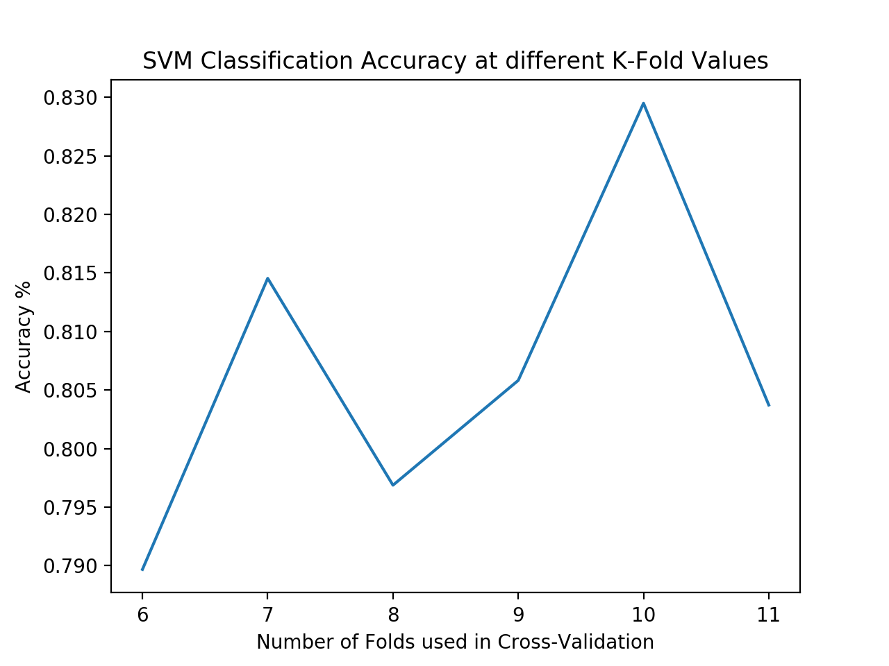
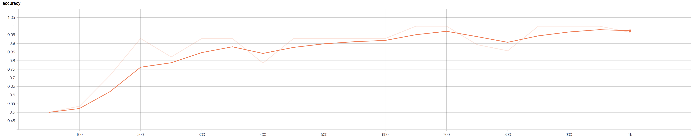
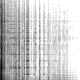

# MusicSpeechClassification
For this project I developed two audio classifiers for the [GTZAN dataset](http://marsyas.info/downloads/datasets.html), a small collection of 128 clips of both music and speech. The goal was to create models which could predict whether a given audio clip was either music or plain human speech. Below are examples taken from the test set.

[Music Example](GTZAN%20Examples/bagpipe.wav)

[Speech Example](GTZAN%20Examples/comedy.wav)

First, I used an AdaBoosted Support Vector Machine with a linear kernel and achieved over 80% classification accuracy. Then I used a Convolutional Neural Network and was able to produce over 95% accuracy on my test set. I also used Principle Component Analysis to visualize the data, as well as [K-Folds cross validation](https://en.wikipedia.org/wiki/Cross-validation_(statistics)#k-fold_cross-validation) to ensure the network didn't overfit.

The SVM's accuracy graph is below, with the x-axis being how many folds were used in the cross-validation. The accuracy at a particular fold was taken to be the average of all the models at that fold. 

The CNN's accuracy graph is below, with the x-axis being how many training steps have elapsed, and was created with TensorBoard. The transparent line is the true accuracy of the model, while the bold line uses the same statistics but is smoothed out. 

For both models I first changed the data representation from raw audio files to their corresponding frequency spectrograms which can be seen below. 

  

In order to train the CNN more quickly, the spectrogram were reduced to grey-scaled 80 x 80 pixel images. 

 

The PCA projections below motivate using the frequency spectrogram representation of the audio, as the clusters are considerably more seperable in the spectrogram PCA graph.

  
