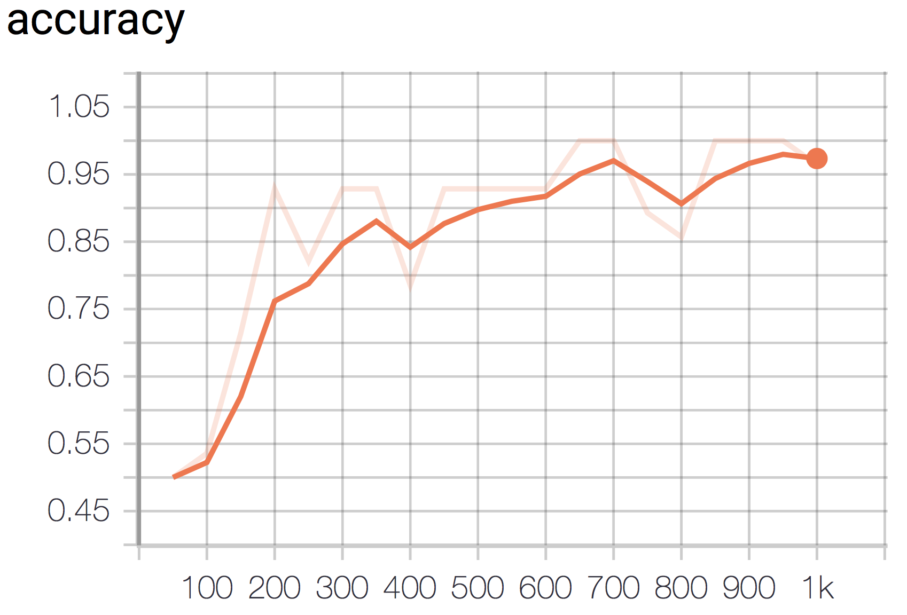

# MusicSpeechClassification
For this project I developed two audio classifiers for the GTZAN dataset, a small collection of 128 clips of both music and speech. The goal was to create models which could predict whether a given audio clip was either music with singing in it or plain human speech. Below are examples taken from the test set.

[Music Example](GTZAN%20Examples/bagpipe.wav)

[Speech Example](GTZAN%20Examples/comedy.wav)

First, I used an AdaBoosted Support Vector Machine with a linear kernel and achieved over 80% classification accuracy. Then I used a three-layer Convolutional Neural Network and was able to produce over 95% accuracy on my test set. I also used PCA to visualize the data, as well as K-Folds cross validation to ensure the network didn't overfit.

Both accuracy graphs can be seen below.

For both models I first changed the data representation from raw audio files to their corresponding frequency spectrograms which can be seen below. 

  

The PCA projections below motivate using the frequency spectrogram representation of the audio, as the clusters are considerably more seperable in the spectrogram PCA graph.

  
